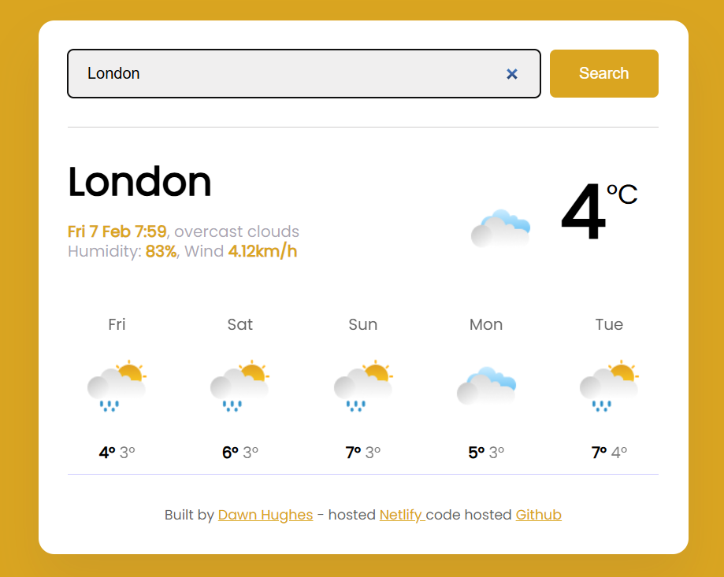
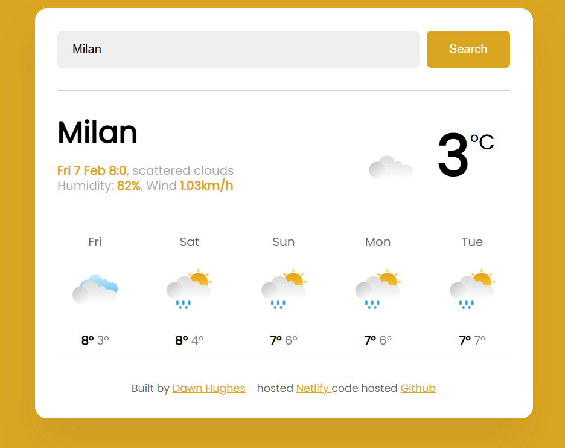
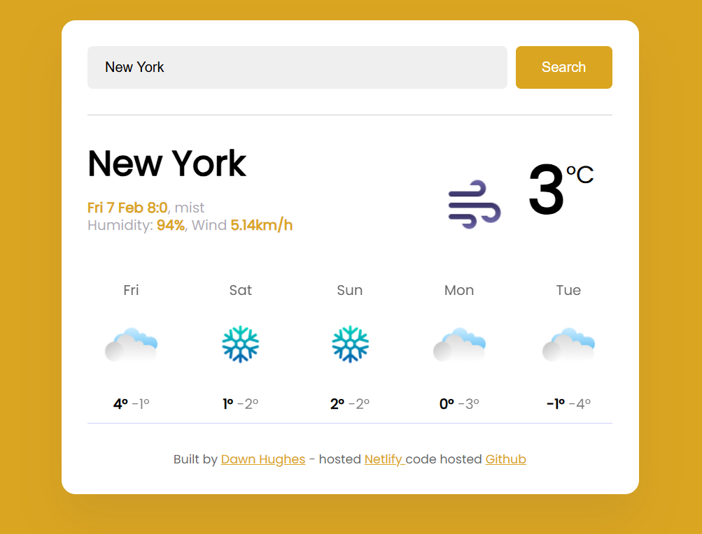
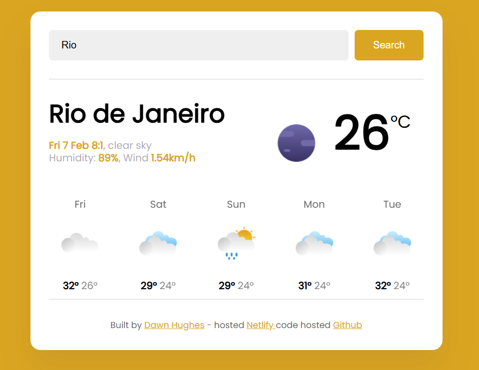

# Vanilla Weather Project

## 🌦️ Overview

The Vanilla Weather Project is a simple yet elegant weather application built using HTML, CSS, and JavaScript. It fetches real-time weather data from the SheCodes Weather API and displays it in an intuitive user interface.

## 🚀 Improvements & Features

🔹 HTML Enhancements

- Semantic Markup: Used for better structure and accessibility.

- Improved Form Handling: The search form now includes required attributes for validation.

- Optimized Font Loading: Reduced redundant Google Font requests for better performance.

## 🎨 CSS Improvements

Enhanced Styling:

- Used the Poppins font for a modern and clean design.

- Improved UI spacing and layout for better readability.

- Added a visually appealing temperature display.

# Responsive Design:

- Ensures a great experience on both mobile and desktop devices.

- Utilized flexbox for better alignment of elements.

## 🛠️ JavaScript Enhancements

- Refactored Weather Fetching Logic:

- Uses axios for efficient API calls.

- Improved error handling for failed API responses.

# Dynamic UI Updates:

- Displays city name, temperature, humidity, wind speed, and weather description dynamically.

- Includes a weather icon that updates according to real-time conditions.

# Forecast Feature:

- Fetches and displays a 5-day weather forecast.

- Formats the date and time properly.

# Code Optimization:

- Used forEach to generate forecast elements dynamically.

- Improved readability with modular functions.

## 📷 Preview
Here’s what my weather app looks like:  

## 🌍 Live Demo

# Click here to view the live app
https://fedawbweatherapp.netlify.app/

## 🛠️ Installation & Setup

Clone the repository:

git clone https://github.com/FedDawb/VanillaWeatherProject

Open index.html in your browser.

## 🖥️ Technologies Used

- HTML for structuring the content.

- CSS for styling and layout improvements.

- JavaScript for fetching and displaying weather data.

- Axios for handling API requests.

- SheCodes Weather API for real-time weather data.

## 📌 Future Improvements

- 🌙 Dark Mode Toggle for better UI accessibility.

- 📍 Geolocation Support to fetch weather based on user's location.

- ⏳ Loading Indicator for better user experience during API calls.

- 📝 Credits

Built by Dawn Hughes - Hosted on Netlify

## ⭐ Contribute

Feel free to fork this project, submit issues, or make pull requests to improve it!
